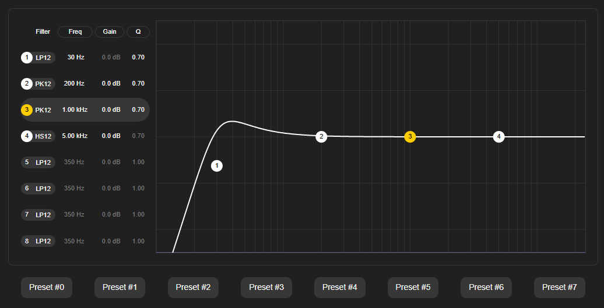

# camillaeq
A graphic equaliser for [CamillaDSP](https://github.com/HEnquist/camilladsp) based on [Weq8](https://github.com/teropa/weq8)

When accessed on the Tomcat port (default 8080) this app provides a UI for a
graphic equaliser (based on Weq8) which can be used to set biquad filters on the
Camilla DSP across 8 frequency bands.

As changes are input on the equaliser,
these are read and a new configuration is built and passed to the Camilla DSP via
its web socket interface. This configuration is automatically made active.
Each configuration preserves the user specified "devices", "mixers" and "processors" sections,
the "filters" section is replaced by a set of filters representing the
biquad settings and the "pipeline" section is edited to reference the filters of the equaliser.

Probably this UI would fit more naturally within the CamillaGUI but this
author does not have the necessary Javascript knowledge.  Until then this
project is hopefully of interest and/or use for other Camilla DSP users.

## Release Build

Prerequisites: JDK 17, Maven 3.9.2

    git clone <this repo>
    cd camillaeq
    mvn -Pproduction clean package
    java -jar .\target\camillaeq-<version>.jar

To override the Tomcat port

    java -jar .\target\camillaeq-<version>.jar --server.port=8080

or to override the CamillaDSP websocket URL

    java -jar .\target\camillaeq-<version>.jar --camilla.url=ws://localhost:1234

## Development

Prerequisites: JDK 17, Maven 3.9.2

    git clone <this repo>
    cd camillaeq
    mvn spring-boot:run

## STATUS

### CamillaEq Version 1.0.x

- successfully tested against CamillaDSP version 3.0.1 both running on Windows 11
- successfully tested against CamillaDSP version 3.0.0 both running on Linux pi 6.6.51

## TODO

- add support for Weq8 24 filters as a pair of 12 filters in series?

## ISSUES

### Weq8

- filter drop down: Add+ and dark stylng
- redraw missing for plot when resized
- get/set state
- grid labelling for the graph
- option to relocate the controls above/below
- config file for number of biquad, types for selection?

### CamillaDSP

- N/A
